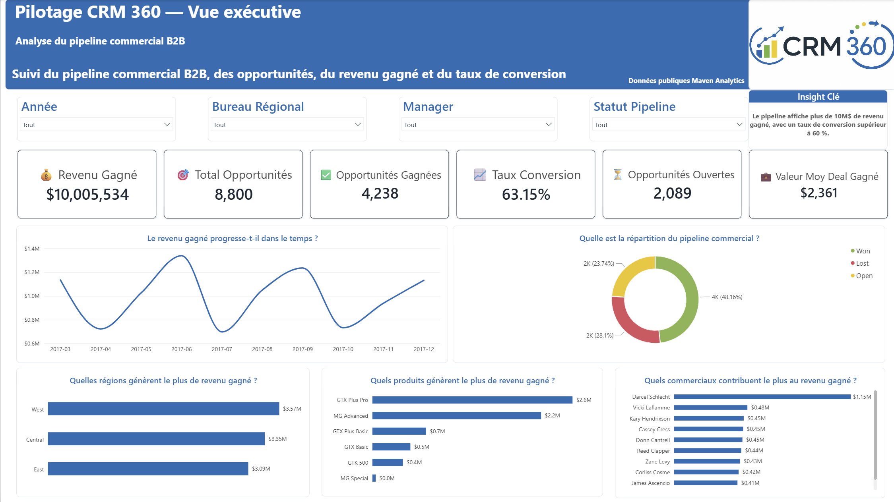
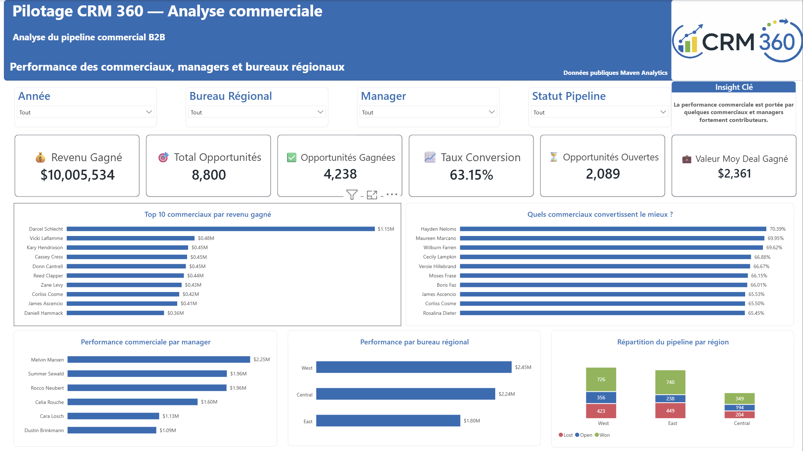
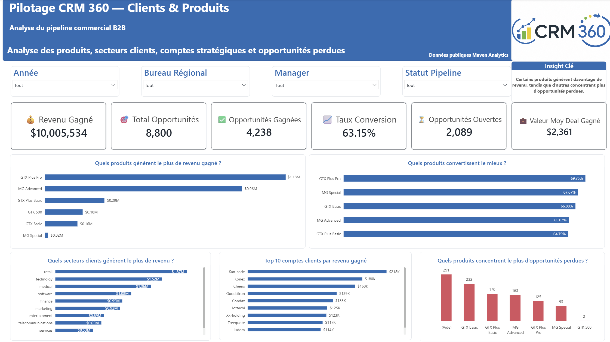

# Pilotage CRM 360 — Analyse du pipeline commercial B2B

## Contexte du projet

Ce projet Power BI analyse un pipeline commercial B2B à partir du dataset public **CRM Sales Opportunities** de Maven Analytics.

L’objectif est de construire un dashboard interactif permettant à une direction commerciale de suivre les opportunités, le revenu gagné, les deals gagnés ou perdus, les commerciaux, les produits, les régions et les comptes clients.

---

## Objectif business

Le dashboard répond aux questions suivantes :

- Quel est le revenu gagné ?
- Quel est le volume total d’opportunités ?
- Quel est le taux de conversion du pipeline ?
- Quels commerciaux génèrent le plus de revenu ?
- Quels produits performent le mieux ?
- Quels secteurs clients contribuent le plus ?
- Où se concentrent les opportunités perdues ?
- Quelles régions commerciales sont les plus performantes ?

---

## Outil principal

- Power BI

---

## Compétences mobilisées

- Power Query
- Modélisation de données
- Relations entre tables
- DAX
- Mesures commerciales
- Dashboard design
- Data storytelling
- Analyse commerciale B2B
- Segmentation client
- Analyse de pipeline CRM

---

## Structure du projet

```text
Pilotage CRM 360/
│
├── donnees/
│   ├── accounts.csv
│   ├── products.csv
│   ├── sales_pipeline.csv
│   ├── sales_teams.csv
│   └── data_dictionary.csv
│
├── power bi/
│   └── pilotage_crm_360.pbix
│
├── capture_ecran/
│   ├── 01_vue_executive.png
│   ├── 02_analyse_commerciale.png
│   └── 03_clients_produits.png
│
├── documentation/
│   └── insights_business.md
│
├── Assets/
│   ├── crm360_logo.png
│   └── CRM360_Harmonie_B2B.json
│
└── README.md
```

---

## Modèle de données

Le modèle repose sur une table de faits et plusieurs tables de dimensions.

### Table de faits

- `Fact_Sales_Pipeline`

### Tables de dimensions

- `Dim_Accounts`
- `Dim_Products`
- `Dim_Sales_Teams`
- `Dim_Calendar`

Les relations permettent d’analyser les opportunités commerciales selon les comptes clients, les produits, les commerciaux, les managers, les régions et les périodes.

---

## KPIs suivis

Le rapport suit les indicateurs suivants :

- revenu gagné ;
- nombre total d’opportunités ;
- opportunités gagnées ;
- opportunités perdues ;
- opportunités ouvertes ;
- taux de conversion ;
- taux de perte ;
- valeur moyenne des deals gagnés.

---

## Aperçu du dashboard

### 1. Vue exécutive



Cette page donne une vue synthétique du pipeline commercial : revenu gagné, opportunités, taux de conversion, statut du pipeline, performance régionale, produits et commerciaux.

---

### 2. Analyse commerciale



Cette page analyse la performance des commerciaux, managers et bureaux régionaux.

---

### 3. Clients & produits



Cette page permet d’analyser les produits, secteurs clients, comptes stratégiques et opportunités perdues.

---

## Insights clés

### 1. Le pipeline génère plus de 10M$ de revenu gagné

Le dashboard montre un revenu gagné supérieur à 10M$, avec un taux de conversion global supérieur à 60 %.

### 2. La performance commerciale est concentrée sur quelques commerciaux

Certains commerciaux contribuent beaucoup plus fortement au revenu gagné que les autres.

### 3. Les régions ne contribuent pas toutes au même niveau

La performance varie selon les bureaux régionaux.

### 4. Certains produits génèrent davantage de revenu

Les produits ne contribuent pas tous de la même manière au revenu gagné.

### 5. Les opportunités perdues doivent être suivies par produit et secteur

Les opportunités perdues peuvent révéler des problèmes de pricing, d’adéquation produit, de concurrence ou de ciblage client.

---

## Recommandations business

1. Analyser les pratiques des commerciaux les plus performants.
2. Mettre en place un suivi mensuel du taux de conversion par commercial, produit et région.
3. Prioriser les produits qui génèrent le plus de revenu gagné.
4. Surveiller les produits et secteurs qui concentrent le plus d’opportunités perdues.
5. Utiliser le dashboard comme outil de pilotage récurrent pour les revues commerciales.

---

## Ce que ce projet démontre

Ce projet montre ma capacité à :

- construire un modèle de données Power BI ;
- nettoyer et transformer des données avec Power Query ;
- créer des mesures DAX commerciales ;
- concevoir un dashboard professionnel ;
- analyser un pipeline CRM B2B ;
- identifier les moteurs de performance commerciale ;
- transformer des données CRM en recommandations business.

---

## Source des données

Dataset public : **CRM Sales Opportunities — Maven Analytics Data Playground**

Les données sont utilisées dans un cadre portfolio et apprentissage.

---

## Auteur

**Ousmane Tawel CAMARA**  
Data & BI Analyst

Projet réalisé dans le cadre de mon portfolio data.
